# sudoku-vision
The goal of this project is to develop an *automatic system for extracting visual information from images containing different variations of Sudoku puzzles*. This is the 1st Assignment of the Computer Vision course taught at the *Artificial Intelligence* master program at University of Bucharest.

### Task 1. Classic Sudoku
Having a picture of a sudoku grid taken with a mobile phone camera (prone to artifacts and can be rotated), determine the structure of the grid and the cells that contain digits.

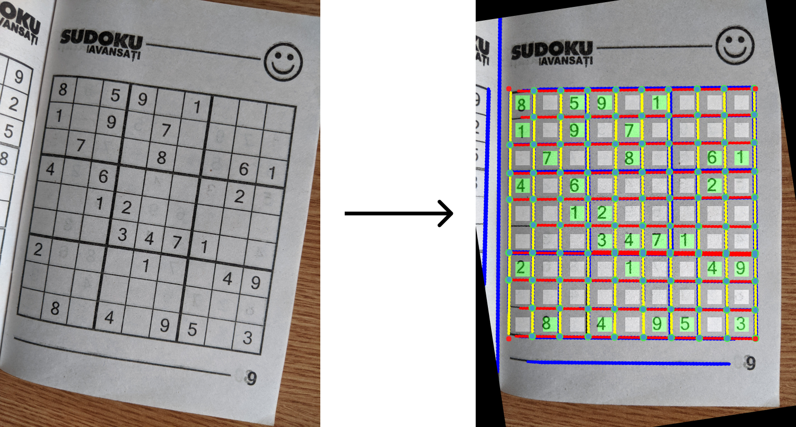

#### Step 1.1. Hough lines detection
We get a binary mask of the image using Canny edge detection. We use these points as positive markers for Hough line detection. The detected lines are marked with blue over the original image.

#### Step 1.2. Merging and Filtering
We merge the lines with similar rho and theta in Hough space. Then, we discard the lines that are not perpendicular on other lines, enforcing the filtering of lines that don’t form a grid pattern. For the remaining lines, we color with red the ones closer to Ox and with yellow the ones closer to Oy. We also draw green dots for the intersection points.

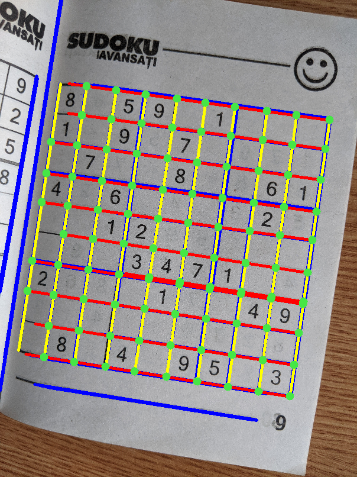

#### Step 1.3. Align with Ox and Oy axes
We group the detected lines if they have similar theta rotations. We should obtain two groups, one representing the horizontal lines (red) and one representing the vertical lines (yellow). We take the average theta for the group determined by the red lines and then apply this rotation on the original image. Now, the Sudoku grid should be aligned with Ox and Oy.

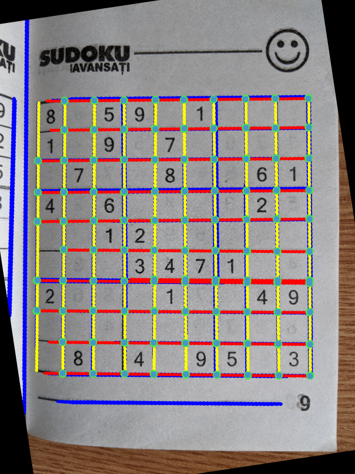

#### Step 1.4. Estimating corners
From this step, we are discussing relative to the aligned image. The corners are determined by taking the lowest and highest coordinates of the set of intersection points on Ox and Oy.

#### Step 1.5. Estimate cell positions
Having the bounding box of the grid, we split equally in a 9 x 9 grid. We overlay a white box over the center of the cell. If we have black pixels inside the cell, we want to mark it as a digit. To avoid errors caused by detecting borders with the same color as the digits, we shrink the cells closer to the center.

#### Step 1.6. Ink mask
To check for digits, we need the mask of black pixels (inked). We get this with a simpler threshold on RGB in range (0, 0, 0) - (100, 100, 100).

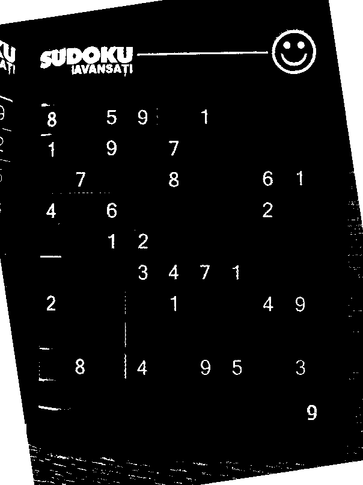

#### Step 1.7. Ink mask
Using the cell positions from Step 1.5 and the binary mask from Step 1.6 we can detect empty and non-empy cells by thresholding the ratio of positive pixels in each cell. The results are marked with a green overlay.

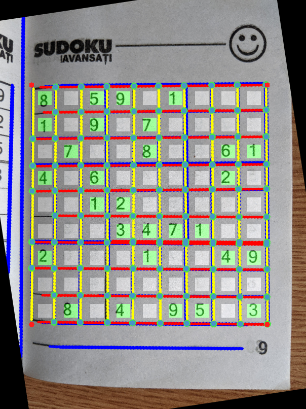

### Task 2. Jigsaw Sudoku
In addition to detecting the sudoku grid and non-empy cells, we now want to determine all the 9 regions containing digits from 1 to 9 in the irregular jigsaw sudoku puzzles.

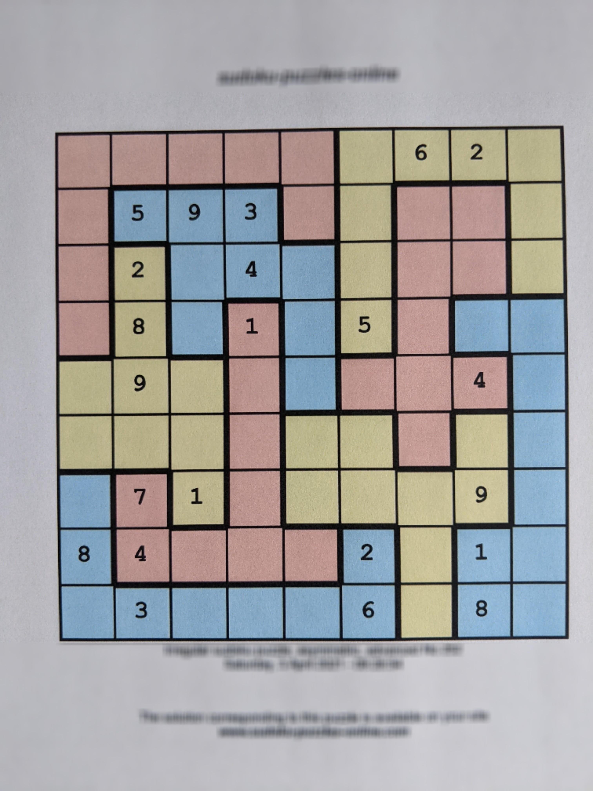

#### Step 2.1. Detecting the region border
The border that separates our regions of interest are thicker than the regular sudoku lines. That means we can create a binary mask as in Step 1.6 and, after a few erosion steps, we will remove the thin lines and have only the region border remaining. To get rid of additional noise as digits and other artifacts, we take the largest connected component in this binary image. This method doesn’t depend on the colors in the original image so it works in the same way on gray jigsaw images.

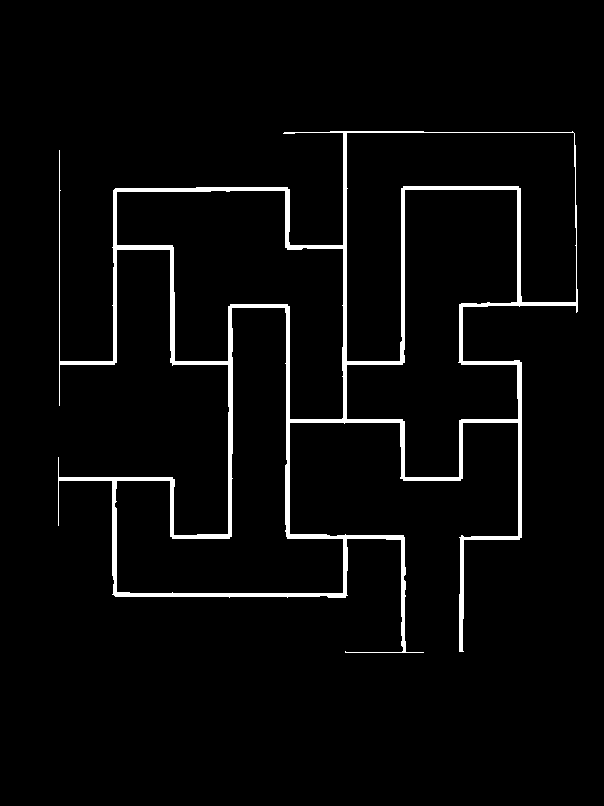

#### Step 2.2. Find regions (connected components)
To label the regions we apply the same logic as finding the connected components in a graph, or regions in a 2D matrix with a flood fill algorithm. We iterate the cells from left to right, top to bottom and if the current cell is not part of any existing regions, we create a new region for it (a new connected component) and start the flood fill from that cell (run depth first search). Two cells are connected if they are adjacent in the grid and if there is no border delimiting them. To determine if we have a border in between, we create an imaginary rectangle that connects the two cells and check if it contains any positive values in the mask generated at Step 2.1. The region labels can be seen bellow:

|   |   |   |   |   |   |   |   |   |
|---|---|---|---|---|---|---|---|---|
| 1 | 1 | 1 | 1 | 1 | 2 | 2 | 2 | 2 |
| 1 | 3 | 3 | 3 | 1 | 2 | 4 | 4 | 2 |
| 1 | 5 | 3 | 3 | 3 | 2 | 4 | 4 | 2 |
| 1 | 5 | 3 | 6 | 3 | 2 | 4 | 7 | 7 |
| 5 | 5 | 5 | 6 | 3 | 4 | 4 | 4 | 7 |
| 5 | 5 | 5 | 6 | 8 | 8 | 4 | 8 | 7 |
| 9 | 6 | 5 | 6 | 8 | 8 | 8 | 7 | 0 |
| 9 | 6 | 6 | 6 | 6 | 9 | 8 | 7 | 7 |
| 9 | 9 | 9 | 9 | 9 | 9 | 8 | 7 | 7 |
|   |   |   |   |   |   |   |   |   |

### Task 3. Cube Sudoku
Having three faces of a sudoku cube, we want to detect all the digits they contain and then reconstruct the 3D sudoku cube. Two adjacent faces have matching valuess on the margin.

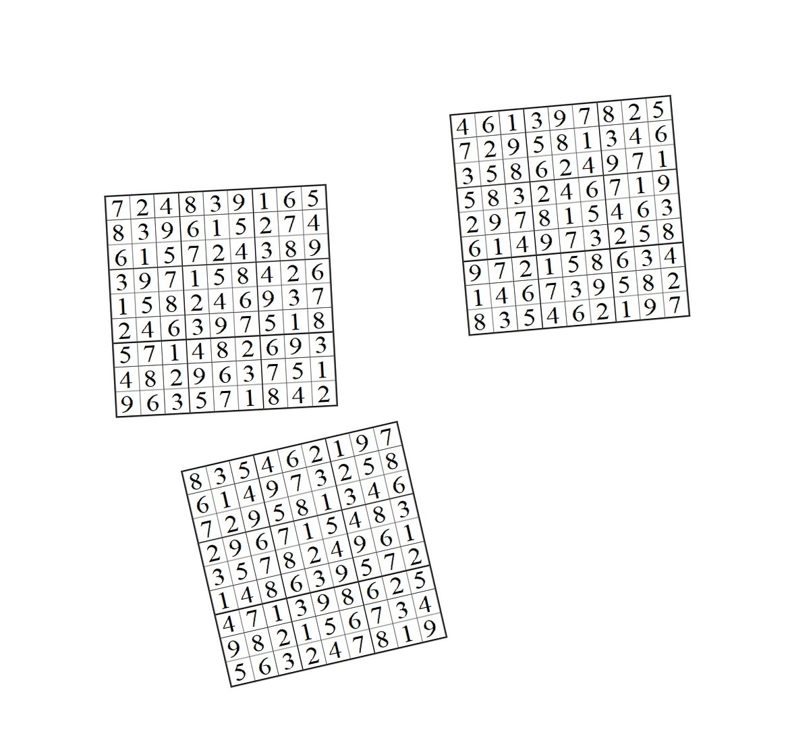

#### Step 3.1. Extract faces
Using similar color filtering as for the first tasks, we create a mask containing positive values where we have pixels part of a sudoku grid. We compute the connected components so we will have 3 separated regions (the biggest components). For each region we take the min-max points on all coordinates and find the bounding box for each face. Similarly to Task 1, we estimate the horizontal rotation for each face, align with the axes and then crop exactly on the corners of the aligned face. We obtain 3 clean and aligned images representing the faces of the cube.

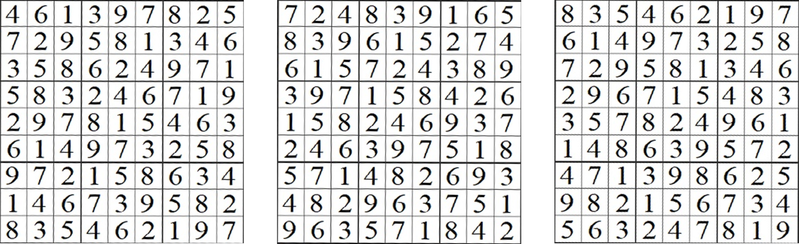

#### Step 3.2. Digit detection
For this step, we use a convolutional architecture trained on MNIST that can classify digits centered in a 28x28 image. We apply a threshold again to get positive values where digits are present and negative values on the background and apply erosion. Now the digits look similar to the MNIST dataset. To get the centered digit regions to feed to the classification model, we iterate as in step 1.5  on the estimated cell positions, as we are now working in the isolated and centered grid face.

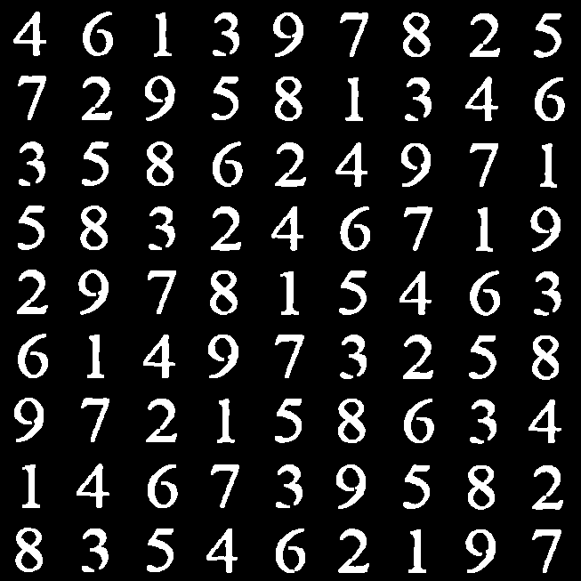

#### Step 3.3. Matching faces
Adjacent faces should have the same values on their intersection. At this point, we know the digits on each face, so we can try all permutations and find the configuration that satisfies this condition.

#### Step 3.3. Projections on the cube

Now, we know which one is the top face, which one is the left one and which one fits on the right. Because our cube template is an idealized geometrical representation, we don’t need perspective projections; a simple affine transformation to wrap the faces on their corresponding positions on the template is enough. We manually pick the coordinates of the vertices of the template cube, but it can be done programmatically if they are marked with specific colors and then we get the index of that color in the image matrix.

These are the final results:

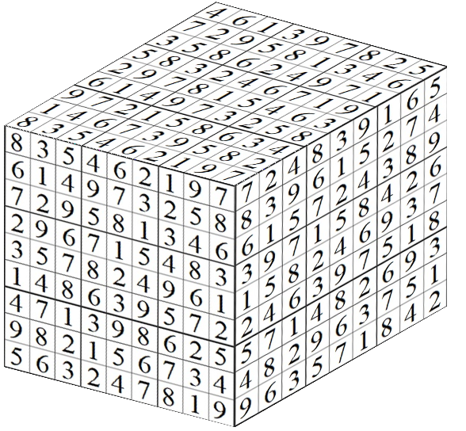

