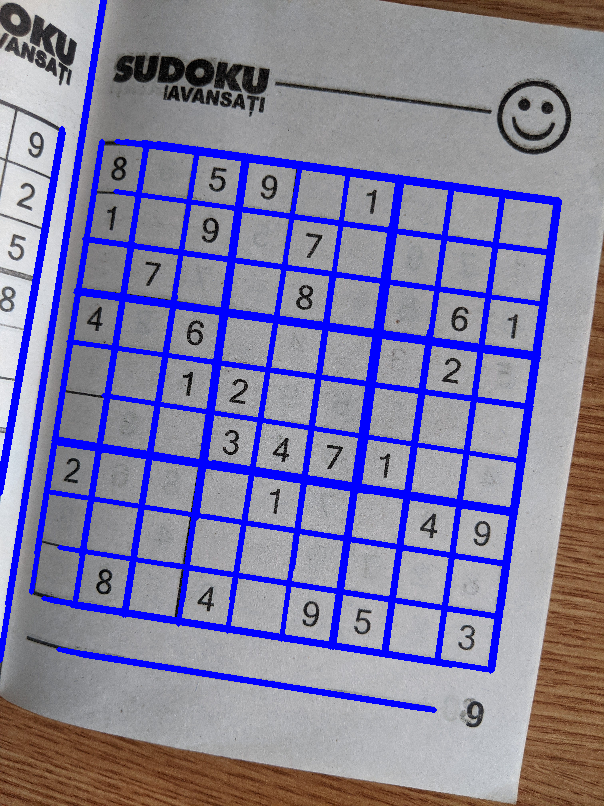
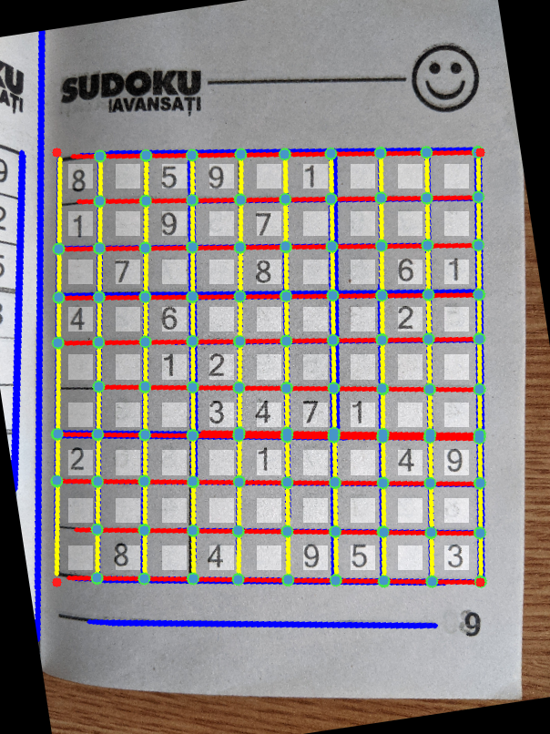

# sudoku-vision
The goal of this project is to develop an *automatic system for extracting visual information from images containing different variations of Sudoku puzzles*. This is the 1st Assignment of the Computer Vision course taught at the *Artificial Intelligence* master program at University of Bucharest.

### Task 1. Classic Sudoku
Having a picture of a sudoku grid taken with a mobile phone camera (prone to artifacts and can be rotated), determine the structure of the grid and the cells that contain digits.

#### Step 1.1. Hough lines detection
We get a binary mask of the image using Canny edge detection. We use these points as positive markers for Hough line detection. The detected lines are marked with blue over the original image.

#### Step 1.2. Merging and Filtering
We merge the lines with similar rho and theta in Hough space. Then, we discard the lines that are not perpendicular on other lines, enforcing the filtering of lines that don’t form a grid pattern. For the remaining lines, we color with red the ones closer to Ox and with yellow the ones closer to Oy. We also draw green dots for the intersection points.

#### Step 1.3. Align with Ox and Oy axes
We group the detected lines if they have similar theta rotations. We should obtain two groups, one representing the horizontal lines (red) and one representing the vertical lines (yellow). We take the average theta for the group determined by the red lines and then apply this rotation on the original image. Now, the Sudoku grid should be aligned with Ox and Oy.

#### Step 1.4. Estimating corners
From this step, we are discussing relative to the aligned image. The corners are determined by taking the lowest and highest coordinates of the set of intersection points on Ox and Oy.

#### Step 1.5. Estimate cell positions
Having the bounding box of the grid, we split equally in a 9 x 9 grid. We overlay a white box over the center of the cell. If we have black pixels inside the cell, we want to mark it as a digit. To avoid errors caused by detecting borders with the same color as the digits, we shrink the cells closer to the center.

#### Step 1.6. Ink mask
To check for digits, we need the mask of black pixels (inked). We get this with a simpler threshold on RGB in range (0, 0, 0) - (100, 100, 100).

#### Step 1.7. Ink mask
Using the cell positions from Step 1.5 and the binary mask from Step 1.6 we can detect empty and non-empy cells by thresholding the ratio of positive pixels in each cell. The results are marked with a green overlay.

